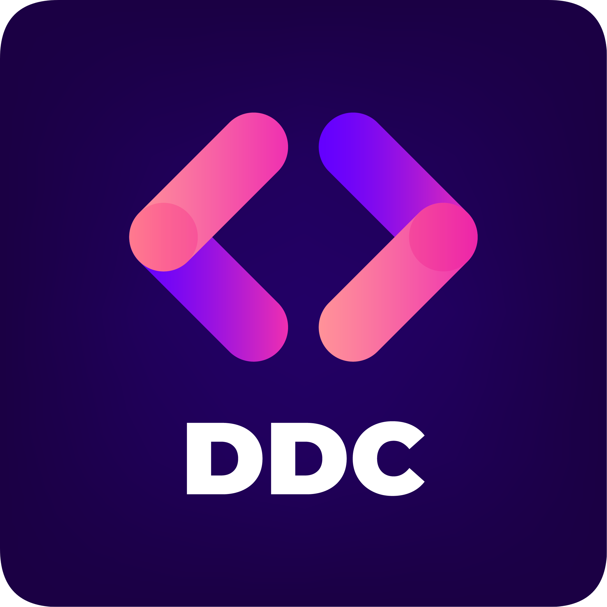

<div id="top"></div>

<!-- PROJECT LOGO -->
<br />

  <a align="left" href="https://github.com/BCIT-DDC">
    
  </a>

<!-- ABOUT THE PROJECT -->

## Web Extension Starter

<!-- <p align="center">
    
</p> -->

A web extension starter, built with React, Typescript, and Tailwind CSS. Build once, and run on multiple browsers: Google Chrome, Mozilla Firefox, Microsoft Edge, and Brave.

### Built With

-   
-   
-   
-   

<!-- GETTING STARTED -->

## Getting Started

### 1. Download starter and install dependencies

Clone this repository:

```
git clone git@github.com:BCIT-DDC/web-extension-ts-starter.git
```

Install npm dependencies:

```
cd web-extension-ts-starter
npm install
```

### 2. Build the Extension

#### Start the Webpack Development Server

```
npm run dev
```

#### Build the Production-Ready Extension

```
npm run build
```

The relevant web extension files will be present in the output `.dist/` folder.

<!-- USAGE EXAMPLES -->

## Usage

--

<!-- ROADMAP -->

## Roadmap

<!-- -   [x] Add Changelog -->

-   [ ] Add support for Opera

See the [open issues](https://github.com/BCIT-DDC/web-extension-ts-starter/issues) for a full list of proposed features (and known issues).

<!-- CONTRIBUTING -->

## Contributing

Contributions are what make the open source community such an amazing place to learn, inspire, and create. Any contributions you make are **greatly appreciated**.

If you would like to contribute, please have a look at our [contributing guidelines](https://github.com/BCIT-DDC/docs/blob/main/contributing.md).

### Contributors

This project exists thanks to all the people who contribute.
<br/>
<a href="https://github.com/BCIT-DDC/web-extension-ts-starter/graphs/contributors">

</a>

<!-- TESTING -->

<!-- ## TESTING -->

<!-- LINTING -->

<!-- ## Linting -->

<!-- LICENSE -->

## License

[MIT](LICENSE.md) © BCIT-DDC

<!-- ACKNOWLEDGMENTS -->

## Acknowledgments

-   [Heroicons](https://heroicons.com/)
-   [Headless UI](https://headlessui.dev/)
